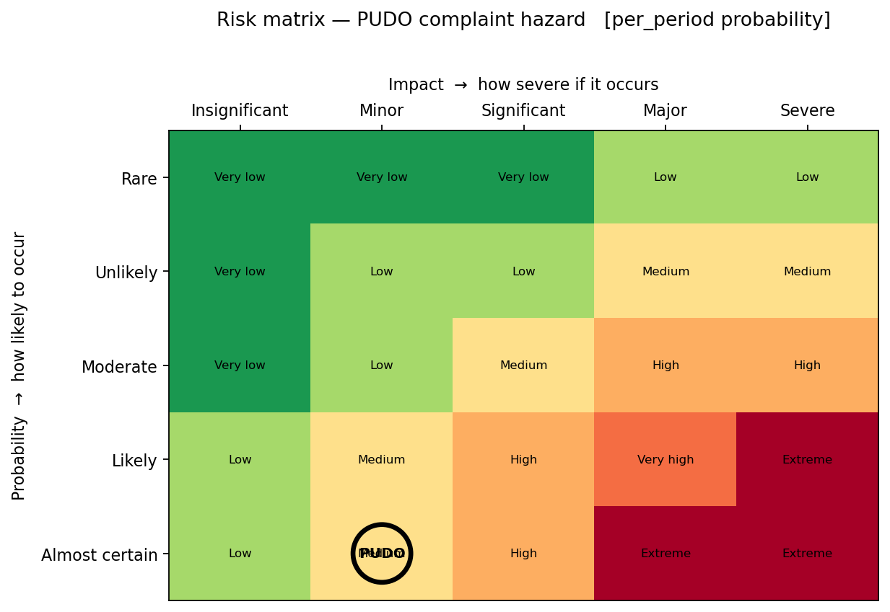

# Project Site Overview

## Website Structure and Key Pages (Quarto Overview)

The main site is built using **Quarto**, which converts `.qmd` (and `.ipynb`) files into a static website. The overall structure and navigation are defined in the `_quarto.yml` file at the root of the project. This file controls the **navbar (top menu)**, theme, and where the rendered site is output (`docs/` folder for GitHub Pages).

- **Home Page** → `index.qmd`  
  Main landing page of the site

- **About Page** → `about.qmd`  
  Team bios and project context

- **Paper** → `paper.qmd`  
  Project paper

More pages will be added as the project progresses.

### Other Useful Quarto Docs

- **Images** → `images/`  
  Where the site grabs images.

- **docs** → `docs/`  
  When the site is built or rendered (quarto render) it will place all the html, css, js etc. code into this folder. This folder is basically the site. It's what the git workflow will pick up (part of the CI/CD) and what github pages will deploy on github. The GitHub Action (Workflow) is responsible for **publishing the rendered Quarto site to GitHub Pages**. It does **not build the site**—it simply takes the already-rendered files in the `docs/` folder and pushes them to the `gh-pages` branch, which GitHub uses to host the website.


## Pulling notebook analytics into `paper.qmd`

`paper.qmd` never has numbers pasted into it by hand — every table, figure, and
headline number is pulled from a plain `assets/` folder that the analysis
notebook writes to. There is exactly one copy of the notebook, and it stays in
its natural home, [`pudo-pipeline/notebooks/pudo_analysis.ipynb`](../pudo-pipeline/notebooks/pudo_analysis.ipynb)
— nothing gets copied or synced into this project.

**How it works:**

1. The notebook's setup cell defines three small helpers — `save_fig`,
   `save_table`, `save_text` — that write into
   `PUDO_ASSETS_DIR` (default `../../project-site/assets`, a relative path
   from the notebook to this project's `assets/` folder):
   - `save_fig(fig, "fig-risk-matrix")` → `assets/fig-risk-matrix.png`
   - `save_table(df, "tbl-trend", "caption...")` → a Pandoc pipe-table with a
     `: caption {#tbl-trend}` line, i.e. `assets/tbl-trend.md`
   - `save_text("some sentence...", "baseline-headline")` → a plain prose
     fragment, `assets/baseline-headline.md`

   Any cell that computes a result worth reusing calls one of these right
   after computing it.

2. `paper.qmd` references those files directly — figures as ordinary Quarto
   images, tables via `` (each `` shortcode must
   sit alone on its own source line, or Quarto silently fails to expand it):

   ```markdown
   {#fig-risk-matrix}

   

   Over the window the rate was
   
   ```

   Quarto numbers and cross-references these like any other figure/table —
   `@fig-risk-matrix` / `@tbl-trend` in prose renders as "Figure 1" / "Table 3"
   — instead of showing raw code-console output.

**Workflow when the analysis changes** (from `pudo-pipeline/`):

```bash
# If data changes run: 
pudo-build --no-download

# If analysis and or data change re-run the notebook (can be done via an IDE as well):
jupyter nbconvert --to notebook --execute --inplace notebooks/pudo_analysis.ipynb
```

That's it — re-executing the notebook overwrites the files in
`project-site/assets/` directly. Then, from `project-site/`:

Lastly, you can reflect the new changes in the paper by rendering tha site:
```bash
quarto render 
```

Commit the updated `assets/*` files alongside `paper.qmd`
changes (and the notebook itself, from wherever you ran it) so anyone who
clones the repo can render the site without re-running the pipeline.

**Viewing the notebook itself:** rather than embedding it into the site (which
would require a duplicate copy inside this project, `paper.qmd` just links to it on GitHub, e.g.
`https://github.com/jonathanwilsonami/curbrisk-av/blob/main/pudo-pipeline/notebooks/pudo_analysis.ipynb`,
which GitHub renders with full code + output in the browser.

## Contributing to The Project Site and or Paper 

### Installing and running Quarto

**This is only needed if you wish to update the informational `Project Site` (see below). This is not
the actual pudo-pipeline but a site for items such as papers.**

Quarto is used to build our project site mentioned above. You will need Quarto if you want to make edits to any documents on the site pages.

To install Qaurto see [Quarto installation guide](https://quarto.org/docs/get-started/)

The following are useful Quarto commands:
```bash
# To render entire site - Note: Need to do this anytime you want your changes to be reflected on the site.
quarto render
# To see the site in your local browser. Make sure you do this to check for any issues.
quarto preview

# To render and view a single notebook
quarto preview <notebook>.qmd
```

#### How Quarto Works (High-Level)

- Each `.qmd` or `.ipynb` file = **one page on the site**
- Quarto renders everything into the `docs/` folder (this is what GitHub Pages serves)
- The `_quarto.yml` file defines:
  - Navigation (navbar + sidebar)
  - Site layout and structure
  - Rendering behavior

---

### Git Workflow for Maintaining and Contributing to the Quarto Site

To keep the Quarto site stable and organized, all work should be done through feature branches rather than directly on `main`. Then make a pull request (PR). 

#### Recommended Step-by-Step Workflow

### Publish To Github Pages

A github workflow ci-cd has been added to automatically push to Github pages. So when you add your changes and push it should automatically push the quarto site too. Note: This will only work if you are working directly on main. If you are working on your own branch your work will show up once your branch has been merged into main. Make sure you run quarto render to render before pushing your changes.  

If you need to manually push to Github Pages use the following command:

```bash
quarto publish gh-pages
```

This will push the quarto site to Github.
